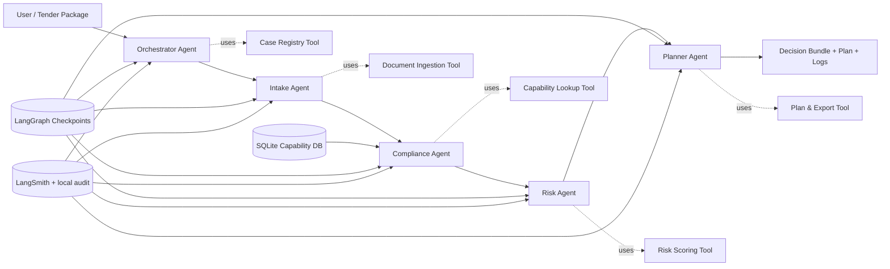

# RemedAI

**RemedAI** is a locally hosted multi-agent system for **public procurement pre-bid intelligence in environmental remediation and groundwater monitoring projects**.

The system helps a small or mid-sized engineering firm decide whether to bid on a tender by extracting mandatory requirements, matching them against internal capabilities, scoring delivery risk, and building a submission plan. It is intentionally **not** a generic chatbot. It is a structured, agentic workflow built to satisfy the CTSE Assignment 2 requirements with:

- 5 agents total: **1 orchestrator + 4 specialist agents**
- LangGraph-based orchestration and stateful routing
- LangChain-based prompting, parsing, and per-agent local Ollama model routing
- Local tools for file ingestion, SQLite capability lookup, risk scoring, and artifact generation
- LangSmith tracing plus local JSONL audit logs
- FastAPI backend that can run without the frontend
- Streamlit frontend to demonstrate the workflow clearly

## Why this domain?

Public-sector remediation tenders are document-heavy, deadline-sensitive, and operationally risky. Smaller engineering firms often lose time manually checking whether they actually qualify to bid. This project automates that decision support loop for a **useful but non-generic** workflow.

## Chosen problem

**Problem statement:**
Evaluate a tender package for a hazardous-site remediation and groundwater monitoring contract, identify mandatory compliance gaps, assess bid risk, and produce a bid / conditional-bid / no-bid recommendation with a submission plan.

## Stack

- **Model runtime:** Ollama with different local SLMs per agent
- **Agent framework:** LangGraph + LangChain
- **Tracing:** LangSmith + local JSONL audit trail
- **Persistence:** LangGraph SQLite checkpointer
- **Backend:** FastAPI
- **Frontend:** Streamlit
- **Data layer:** local SQLite + local seed files

## Agent-specific model assignment

RemedAI uses a different local Ollama model for each major agent instead of routing the full workflow through one model. The defaults are configurable in `.env`.

| Agent | Default model | Why it is used |
|---|---|---|
| Orchestrator | `gemma2:2b` | Lightweight routing and objective framing |
| Intake | `qwen2.5:7b` | Strong structured extraction from tender text |
| Compliance | `llama3.1:8b` | Careful evidence comparison and gap analysis |
| Risk | `mistral:7b` | Concise risk reasoning and recommendation wording |
| Planner | `phi3:mini` | Fast, focused task-plan generation |

The `/health` endpoint returns the active model map, and the local JSONL audit log records the model used by each agent.

## Repository layout

```text
RemedAI/
├── backend/                 # API, graph, agents, tools, services
├── frontend/                # Streamlit UI
├── data/                    # sample input and seed company knowledge
├── docs/                    # report, mapping to rubric, project description
├── scripts/                 # bootstrap, demo runner, report generator
├── tests/                   # unified evaluation harness + per-agent tests
└── runtime/                 # created at bootstrap / run time
```

## Architecture



## Quickstart

1. Create a virtual environment and install dependencies.
2. Ensure Ollama is installed and running.
3. Pull the required local models.
4. Bootstrap the local seed database and runtime folders.
5. Start the backend.
6. Start the frontend.

```bash
python -m venv .venv
source .venv/bin/activate
pip install -r requirements.txt
cp .env.example .env
ollama pull gemma2:2b
ollama pull qwen2.5:7b
ollama pull llama3.1:8b
ollama pull mistral:7b
ollama pull phi3:mini
python scripts/bootstrap.py
uvicorn backend.app.main:app --reload --port 8000
# in a second terminal
streamlit run frontend/app.py
```

## Backend-only usage

```bash
python scripts/run_sample_case.py --sample remediation_tender
```

Or with HTTP after the backend is running:

```bash
curl -X POST http://127.0.0.1:8000/api/v1/analyze/sample \
  -H "Content-Type: application/json" \
  -d '{"sample_id": "remediation_tender", "query": "Should we bid on this tender?"}'
```

## Sample case

The seeded sample tender is intentionally designed so the system produces a **conditional bid** recommendation: the company is strong on groundwater monitoring and remediation delivery, but has gaps in 24x7 emergency response coverage and airborne site mapping evidence.

## Key deliverables generated per case

- executive summary (`summary.md`)
- compliance matrix (`compliance_matrix.csv`)
- risk register (`risk_register.csv`)
- submission plan (`submission_plan.json`)
- machine-readable final bundle (`final_bundle.json`)
- local audit log (`audit.jsonl`)

## Testing and evaluation

This repository includes a **unified evaluation harness** plus per-agent tests to match the assignment brief:

- deterministic tool tests
- graph smoke test
- property-based validation for parsing and risk scoring
- per-agent assertions for output correctness and anti-hallucination behavior

Run everything with:

```bash
pytest -q
```

## Important notes

- LangSmith tracing is enabled when valid environment variables are present.
- If LangSmith credentials are absent, the project still writes a local JSONL audit trail so the observability requirement remains demonstrable offline.
- The included report contains placeholders for **team names** and **final GitHub URL** because those details were not supplied.
- A real demo video cannot be auto-produced here, so a full **4-5 minute video script and demo checklist** are included in `docs/demo_video_script.md`.
